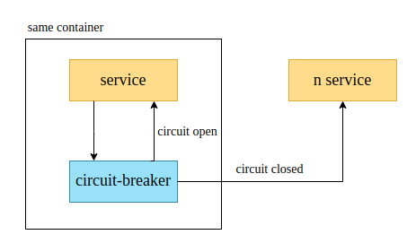

# unbreakable
## A simple handmade circuit-breaker

The idea is create a circuit breaker with purely java as a module to people can just plug in into their service and add a block of code that will manage and try to recover from fail request from the remote calls, http request, whatever you place in the lambda block.

If you are not familiar with this concept, here is the [post](https://martinfowler.com/bliki/CircuitBreaker.html) from martin fowler that I'm taking the architeture to implement the circuit breaker with the self healing approach.

  
  
How can be used.

## TODO

1. Improve call method with a better sync approach.
2. Create the self healing job to recovery the circuit to closed state.
3. Create simple tests.
